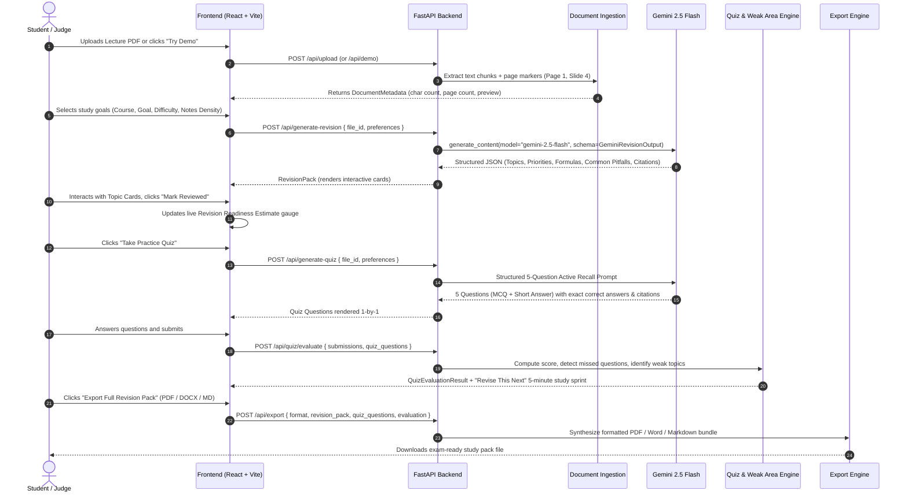

# RevisionOS — System Architecture & Data Flow

RevisionOS transforms passive lecture material into an active, exam-ready revision loop:
**UPLOAD → UNDERSTAND → PRIORITIZE → REVISE → TEST → IDENTIFY WEAKNESS → TARGETED REVISION → EXPORT**

---

## 1. System Architecture Diagram

```mermaid
graph TD
    User([Student / Judge]) -->|1. Uploads PDF/DOCX/PPTX/TXT or Demo| Frontend[React + TypeScript + Vite SPA]
    
    subgraph Frontend Layer
        Landing[Landing Hero & Dropzone]
        PrefsModal[Personalization Modal]
        ProgressSeq[7-Step Processing Pipeline]
        Dashboard[Revision Workspace Dashboard]
        TopicCards[Expandable Grounded Topic Cards]
        QuizFlow[Distraction-Free Active Recall Quiz]
        WeakSprint[Revise This Next Micro-Revision]
        ExportModalUI[Export Study Pack Dialog]
    end

    Frontend -->|REST API Calls /api/*| Backend[FastAPI Application]

    subgraph Backend Services Layer
        UploadRoute[/api/upload & /api/demo]
        DocService[Document Service PyMuPDF, python-docx, python-pptx]
        GroundingService[Grounding & Citation Engine]
        GeminiService[Google GenAI SDK Service]
        QuizService[Active Recall & Weak-Area Evaluator]
        ExportService[ReportLab PDF, python-docx & Markdown]
    end

    Backend -->|JSON Schema Prompting| GeminiAPI[Google Gemini 2.5 Flash API]
    Backend -->|Binary Document Streams| User
```

---

## 2. End-to-End Data Flow



---

## 3. Core Architectural Highlights

1. **Strict Source Grounding Engine**:
   - Zero hallucinated theorems or external facts.
   - Text chunks are parsed with preservation of physical source boundaries (`Page N`, `Slide N`, `Section N`).
   - Every note, formula, common pitfall, and quiz question is anchored to an explicit citation badge.

2. **Structured Output Architecture**:
   - Uses the official Google GenAI SDK (`google-genai` 2.23.0) with strict Pydantic schemas passed to `response_schema` and `response_mime_type="application/json"`.
   - The frontend consumes clean typed JSON objects without parsing fragile freeform markdown.

3. **Smart Priority Classification**:
   - Topics are classified into `HIGH`, `MEDIUM`, and `LOW` revision priority based purely on structural evidence: repetition, formal definitions, formulas, and explicit exam warnings. Unsupported hype labels (like "Guaranteed Exam Question") are forbidden.

4. **Closed-Loop Active Learning**:
   - `LEARN → TEST → IDENTIFY WEAKNESS → TARGETED REVISION`
   - Quizzes are not vanity features; misses directly generate a tailored 5-minute micro-revision study sprint targeting specific gaps.

5. **Multi-Format Publication Export**:
   - ReportLab synthesizes publication-quality PDFs with custom tables, colored callout boxes, and headers.
   - `python-docx` produces editable Microsoft Word documents with hierarchical heading styles.
   - Native Markdown export creates portable notes for Obsidian and Notion.

6. **Fault-Tolerant Demo Mode**:
   - A legitimate, authentic lecture PDF covering *Operating Systems: CPU Scheduling* is pre-bundled in `backend/demo_assets/`.
   - Judges can test the entire pipeline in under 30 seconds with 1 click.
